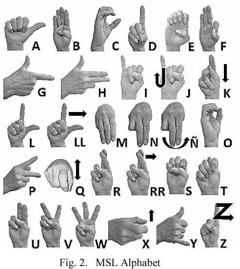

# 🤟 Sign Language to Speech Translator

A real-time Sign Language recognition system that converts hand gestures (ASL or Mexican Sign Language) into speech using a trained deep learning model and OpenCV. This project empowers inclusive communication by recognizing hand signs and synthesizing them into spoken words.

---

## 📸 Demo Video


---

## 🗂️ Folder Structure

```
.
├── model/
│   ├── keras_model.h5          # Trained hand sign classification model
│   └── labels.txt              # Corresponding labels for the model
├── Mexican_SL.png              # Reference image for Mexican Sign Language
├── dataCollection.py           # Script to collect hand gesture data
├── voice.py                    # Handles text-to-speech synthesis
├── wordbuilding.py             # Main script to build and speak words from gestures
├── test.py                     # Optional: used for testing purposes
├── requirements.txt            # Required Python libraries
└── README.md                   # Project documentation (you’re here)
```

---

## 💡 Features

- Real-time hand detection using `cvzone` and `OpenCV`
- Letter classification using TensorFlow/Keras model
- Word construction and text-to-speech via `pyttsx3`
- Time-based delay to avoid repeated letters
- Simple keyboard interactions to speak or modify output

---

## 🎮 Controls

| Key | Action                          |
|-----|-------------------------------- |
| `s` | Speak the currently formed word |
| `b` | Delete the last added letter    |
| `q` | Quit the program                |

---

## ⚙️ Installation & Running

1. **Clone the repository:**

   ```bash
   git clone https://github.com/rkpothamsetti/signlanguage_detection.git
   cd sign-language-to-speech
   ```

2. **Install dependencies:**

   ```bash
   pip install -r requirements.txt
   ```

3. **Run the main script:**

   ```bash
   python wordbuilding.py
   ```

> ✅ Make sure your webcam is active and functional.

---

## 🧪 Train Your Own Model (Optional)

The classifier is trained using [Teachable Machine](https://teachablemachine.withgoogle.com/).

To use a custom model:

- Replace `model/keras_model.h5` and `model/labels.txt` with your own files.
- Use `dataCollection.py` to collect training images if needed.

---

## 🖼️ Reference Chart

Here’s a visual guide used during training:



---

## 🙏 Acknowledgments

- [CVZone](https://github.com/cvzone) by Murtaza Hassan
- OpenCV & NumPy for image processing
- pyttsx3 for text-to-speech
- Google’s Teachable Machine for training the model

---

## 📄 License

This project is licensed under the **MIT License** — feel free to use and modify!

---

## 🚀 Future Improvements

- Add full-word detection model
- Support sentence formation and context awareness
- Mobile version with TensorFlow Lite
